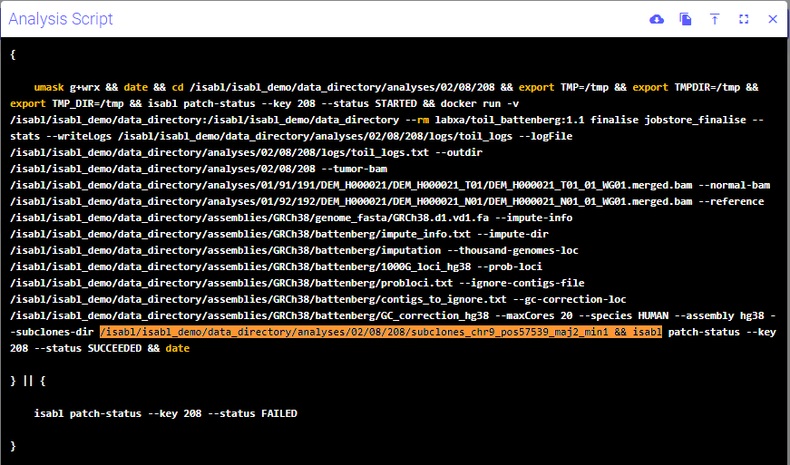

# Análisis de muestras

\*En primer lugar, debemos contar con las muestras (los fastq's) bien identificadas, donde el nombre del paciente, de la muestra y la alícuota sean claros.

Por ejemplo: paciente1\_MuestraT1\_01\_R1.fastq.gz

## Creación de un nuevo proyecto

En el menú desplegable de la esquina superior derecha  (1).png>), pulsar el icono  para crear un nuevo proyecto.

Aparecerá una ventana emergente donde se escribirá, como mínimo, el título del proyecto y, a mayores, el grupo que lo solicita (_Group_) y las personas implicadas en su análisis.

<figure><figcaption></figcaption></figure>

## Importación de metadatos (pacientes y muestras)

Todos los datos asociados al paciente y sus muestras se registran en una hoja modelo de Excel.

Para importar los datos, desde la ventana del proyecto que se acaba de crear, hacer _click_ en el recuadro azul (click here to register new metadata), que abrirá una nueva ventana emergente.

<figure><figcaption></figcaption></figure>

En la ventana emergente, se puede descargar la plantilla de Excel en la que se incluirán todos los datos de pacientes y muestras del proyecto. Para tenerla lo más actualizada posible, se recomienda descargarla para cada nuevo proyecto, haciendo _click_ en _Get form_.

<figure><figcaption></figcaption></figure>

La plantilla se descarga con el nombre "SubmissionTemplate\_aaaa-mm-dd" y se recomienda completar el máximo de campos posibles (una fila por muestra), e ineludiblemente todos aquellos donde se incluya el término _(required)_ tanto sobre datos del individuo como de la muestra.&#x20;

Una vez se haya cumplimentado la plantilla, subir el archivo haciendo _click_ en el icono  (o soltar el archivo sobre la pantalla emergente) y pulsar _Commit submission_.


## Importar datos

Para importar los datos, desde la carpeta que contiene los fastq's, se corre la siguiente secuencia: comando de importar (isabl-import-data) + identificador que vamos a usar para asociar fastq y muestra (-id sample.identifier) + --ignore-ownership + filtro por el número del proyecto que nos interesa + directorio en el que se encuentran los archivos fastq

El número de proyecto se obtiene de la columna key:

<figure><figcaption></figcaption></figure>


```
^/isabl-import-data -id sample.identifier --ignore-ownership -fi projects.pk N -di /path/to/isabl_demo/assets/staging/fastqs
```


Ejemplo:


```
^/(isabl-cli) raquel@pinchinX:~/isabl/fastqs$ isabl-import-data -id sample.identifier --ignore-ownership -fi projects.pk 4 -di /isabl/isabl_demo/assets/staging/fastqs
```


Tras este comando, el programa comprobará si se puede llevar a cabo y, de ser así, aparecerá en pantalla el siguiente mensaje:

```
/add --commit to proceed.
```

Ejemplo de resultado del comando:

<figure><figcaption></figcaption></figure>

Para continuar, se copia la última línea que se ha escrito y al final se añade --commit:


```
^/isabl-import-data -id sample.identifier --ignore-ownership -fi projects.pk 4 -di /directorio/subdirectorio --commit
```


Si por la razón que sea no podemos utilizar anterior comando y tenemos que lanzar el análisis de las muestras de forma individual se empleará el siguiente (comenzando con el programa de alineamiento, bwamen2, se desencadenan el resto de análisis):

`isabl apps-grch38 bwamem2-1.1.0 -fi system_id`` `<mark style="color:green;">`nombre_muestra`</mark>` ``--commit`

Al que luego, si todo está OK, se le añadirá --commit como en los casos previos.

```
isabl apps-grch38 bwamem2-1.1.0 -fi system_id nombre_muestra --commit
```

Ejemplo:

isabl apps-grch38 bwamem2-1.1.0 -fi system\_id <mark style="color:green;">DEM\_H000062\_T01\_01\_WG01</mark> --commit

## Resultados

Una vez se ha comenzado a correr el programa, para ver el estado en el que se encuentran los distintos programas/análisis de la muestra, se abre, en el navegador, la pestaña "Analyses" donde aparece el estado (_status_) en el que se encuentran:

* .png>):
* .png>):&#x20;
*  (1).png>):&#x20;
*  (1).png>): el programa está esperando una acción del usuario.
*  (1).png>): el programa se ha completado con éxito.
* .png>): el programa ha fallado y se tiene que volver a correr.

<figure><figcaption></figcaption></figure>

**Battenberg** se mostrará "in progress" y solicitará una acción para continuar. Antes de avanzar, se comprobará que es creíble el resultado que devuelve el programa, para lo que se deben comprobar, manualmente, las imágenes sobre ploidía de los cromosomas.&#x20;

Se debe comprobar que el BAF y el logR no presentan nada extraño (dentro de las alteraciones de ganancia y pérdida esperadas, el orden de magnitud tiene que tener sentido). Se comparan las magnitudes de las alteraciones vistas en logR del `tumor profile` con las del `non rounded profile` para ver si coinciden.

En las imágenes `non rounded profile` de cada cromosoma (como las siguientes imágenes. Estos plots son temporales) se muestran las alteraciones <mark style="color:green;">clonales en verde</mark> (la mayoría) y las <mark style="color:red;">subclonales en rojo</mark> (menos numerosas). Si todas las alteraciones son subclonales, se debe repetir el análisis.&#x20;

<div align="center">

<figure><figcaption></figcaption></figure>

</div>

<figure><figcaption></figcaption></figure>

Para verificar que el resultado que nos muestra battenberg de forma automática es correcto, se observará en el segmento con la alteración clonal de mayor tamaño (no subclonal) si realmente es correcto el cálculo automático. Para ello, comprobaremos las variantes contenidas en dicho segmento y veremos si es creíble lo que dice battenberg, tendremos en cuanta lo poco probable (o no) que es que se produzca Whole-Genome Doubling, que haya un aumento de número de copias desproporcionado en una determinada región o lo poco probable que es que haya 2 copias de un alelo y 5 de otro (cuando lo más probable es que haya 1 y 2 copias de cada alelo), etc. Integrando todo lo que se sabe, se toma una de las dos opciones:

1.  <mark style="color:green;">**Resultado original correcto**</mark>: si no se tiene que realizar ninguna modificación (nos creemos el resultado devuelto), se correrá el siguiente comando, teniendo en cuenta que una vez se haga no hay posiblidad de modificar el resultado de battenberg:

    * tras correr el programa `isabl`
    * correr: isabl + apps-grch38 + battenberg-3.5.2\_finalise + -p muestra (usaremos el código _Experiment System ID_ recogido en el programa) + --subclones-original
    * El programa comprobará el comando y si puede continuar nos indicará que introduzcamos --commit al final de la última línea

    Ejemplo:  `isabl apps-grch38 battenberg-3.5.2_finalise -p DEM_H000017_T01_01_WG01 DEM_H000017_N01_01_WG01 --subclones-original --commit`
2. <mark style="color:orange;">**Resultado original incorrecto**</mark>: si se quiere modificar algún parámetro se pueden consultar los comandos pertinentes para según cuál se desee modificar en `isabl apps-grch38` apareciendo los siguientes:

```
battenberg-3.5.2_finalise Finalise a cgpBattenberg run.
battenberg-3.5.2_forcecn Force copy number for a cgpBattenberg run
battenberg-3.5.2_refitcn Refit copy number for a cgpBattenberg run
battenberg-3.5.2_subclones Battenberg pipeline for the discovery of...
```

En caso de querer modificar el número de copias, se corre el comando _battenberg-3.5.2\_refitcn_ e indicar el cambio (este paso se puede repetir tantas veces como se desee hasta que se consiga un resultado satisfactorio). Nos puede ayudar en la interpretación el parámetro "Goodness of fit".

**Goodness of fit**: este parámetro describe lo bien que se ajustan los resultados obtenidos a los esperados. Lo ideal sería que fuera superior al 90% (?) pero no siempre se va a conseguir. Si cambiando los parámetros de battenberg se ve que desciende mucho el %, se hará otra prueba hasta que el resultado sea satisfactorio.

Por ejemplo, un segmento del cromosoma 4, aparece que existe un aumento del número de copias de 3+2 y consideramos que en realidad es un aumento 2+1 y dicho segmento tiene BAF 0.57 y logR de 0.31 corremos el siguiente comando:


```
/data/programs/docker_papaemmelab/toil_battenberg/toil_battenberg/recalculate_psi_rho.py --BAF 0.57 --logR 0.31 --nMajor 2 --nMinor 1
```


Devuelve un resultado de rho y psi, siendo rho la pureza y psi la ploidía de la muestra:

```
rho from reference segment: 0.3474178403755867
psi from reference segment: 1.708657759200939
```


Ejemplo completo:


```
(.isabl-cli) raquel@pinchinX:~$ /data/programs/docker_papaemmelab/toil_battenberg/toil_battenberg/recalculate_psi_rho.py --BAF 0.6 --logR -0.21 --nMajor 2 --nMinor 1
rho from reference segment: 0.4999999999999997
psi from reference segment: 3.7834409195264374
(.isabl-cli) raquel@pinchinX:~$ isabl apps-grch38 battenberg-3.5.2_refitcn -p DEM_H000021_T01_01_WG01 DEM_H000021_N01_01_WG01 -chr 9 --start-position 57539 --major-allele 2 --minor-allele 1
```


Si el resultado es satisfactorio, se corre el comando pertinente. Para ello, se necesita el directorio donde se encuentra la información del reajuste, el cual se puede consultar en .png>) y se tomará el último directorio que aparece (señalado en naranja en la siguiente imagen):

<figure><figcaption></figcaption></figure>

Se corre el comando:


```
isabl apps-grch38 battenberg-3.5.2_finalise -p muestra_tumor muestra_normal --subclones-directory directorio
```


Ejemplo:


```
isabl apps-grch38 battenberg-3.5.2_finalise -p DEM_H000021_T01_01_WG01        DEM_H000021_N01_01_WG01 --subclones-directory /isabl/isabl_demo/data_directory/analyses/02/08/208/subclones_chr9_pos57539_maj2_min1
```


Si todo está ok, y aparece RAN 1 | SKIPPED 0 | INVALID 0 en la terminal, se seguirán las instrucciones y se introducirá la última línea de comando seguida de --commit.

En caso de haber introducido, por ejemplo, mal el directorio, puede aparecer el mensaje RAN 0 | SKIPPED 1 | INVALID 0 dando error al correr el programa. Para que se vuelva a correr, se corregirá la línea de código y si aparece el mensaje RAN 1 | SKIPPED 0 | INVALID 0 se correrá con --restart.

Nota: Para consultar cómo correr un comando escribir --help tras el comando que queramos, por ejemplo, `isabl apps-grch38 battenberg-3.5.2_finalise --help` y se mostrará cómo ejecutarlo.


